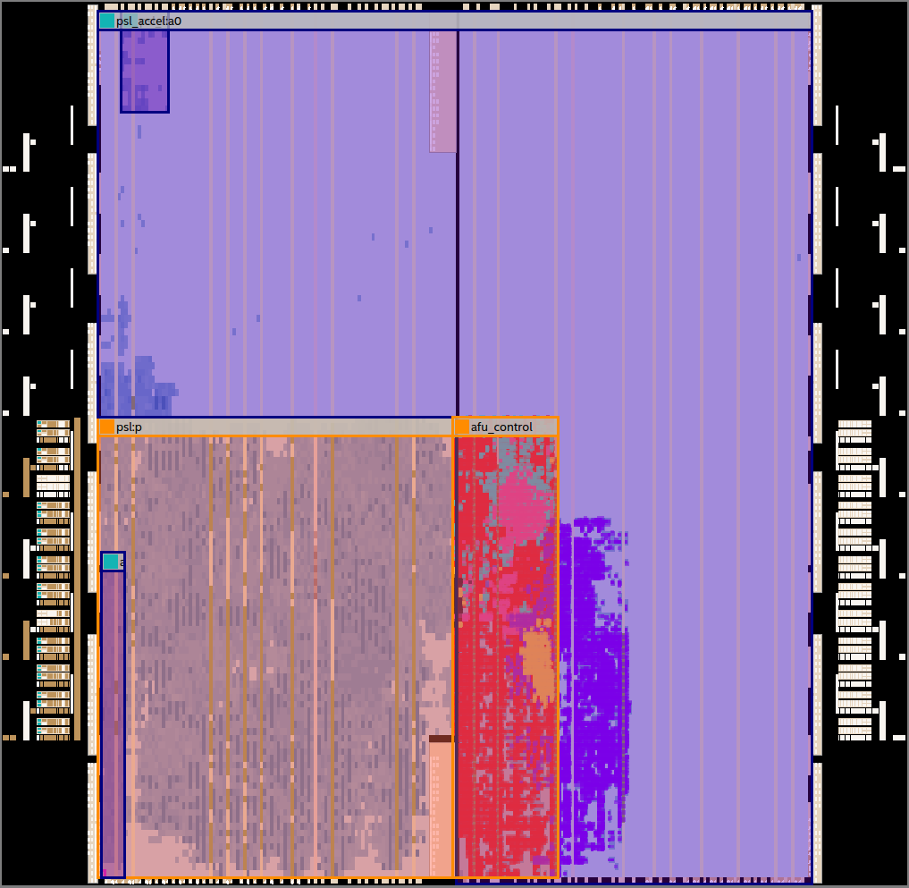

[](https://travis-ci.com/atmughrabi/CAPIPrecis)
<p align="center"></p>

#  Coherent Accelerator Processor Interface (CAPI) Abstract Layer

## Overview 

<p align="center"></p>

CAPI-Precis is an abstraction layer (AFU Control) that simplifies communication and buffering with the Power Service Layer (PSL). While each control unit handling different aspects of communication with the PSL, it simplifies the interface for sending and receving memory transactions, and preserves the fine-grain random or sequentail memory access pattern. Furthermore our layer differentiate its self from other CAPI frameworks, by keeping the PSL cache support.

# Installation 

## Dependencies

### OpenMP
1. OpenMP is already a feature of the compiler, so this step is not necessary.
```console
CAPI@Precis:~$ sudo apt-get install libomp-dev
```

### CAPI
1. Simulation and Synthesis
  * This framework were developed on Ubuntu 18.04 LTS.
  * ModelSim is used for simulation and installed along side Quartus II 18.1.
  * Synthesis requires ALTERA Quartus, starting from release 15.0 of Quartus II should be fine.
  * Nallatech P385-A7 card with the Altera Stratix V GX A7 FPGA is supported.
  * Environment Variable setup, `HOME` and `ALTERAPATH` depend on where you clone the repository and install ModelSim.

```bash
#quartus 18.1 env-variables
export ALTERAPATH="${HOME}/intelFPGA/18.1"
export QUARTUS_INSTALL_DIR="${ALTERAPATH}/quartus"
export LM_LICENSE_FILE="${ALTERAPATH}/licenses/psl_A000_license.dat:${ALTERAPATH}/licenses/common_license.dat"
export QSYS_ROOTDIR="${ALTERAPATH}/quartus/sopc_builder/bin"
export PATH=$PATH:${ALTERAPATH}/quartus/bin
export PATH=$PATH:${ALTERAPATH}/nios2eds/bin

#modelsim env-variables
export PATH=$PATH:${ALTERAPATH}/modelsim_ase/bin

#CAPIPrecis project folder
export CAPI_PROJECT=00_CAPIPrecis

#CAPI framework env variables
export PSLSE_INSTALL_DIR="${HOME}/Documents/github_repos/${CAPI_PROJECT}/01_capi_integration/pslse"
export VPI_USER_H_DIR="${ALTERAPATH}/modelsim_ase/include"
export PSLVER=8
export BIT32=n
export LD_LIBRARY_PATH="$LD_LIBRARY_PATH:$PSLSE_INSTALL_DIR/libcxl:$PSLSE_INSTALL_DIR/afu_driver/src"

#PSLSE env variables
export PSLSE_SERVER_DIR="${HOME}/Documents/github_repos/${CAPI_PROJECT}/01_capi_integration/accelerator_sim/server"
export PSLSE_SERVER_DAT="${PSLSE_SERVER_DIR}/pslse_server.dat"
export SHIM_HOST_DAT="${PSLSE_SERVER_DIR}/shim_host.dat"
export PSLSE_PARMS="${PSLSE_SERVER_DIR}/pslse.parms"
export DEBUG_LOG_PATH="${PSLSE_SERVER_DIR}/debug.log"

```
2. AFU Communication with PSL
  * please check [(CAPI User's Manual)](http://www.nallatech.com/wp-content/uploads/IBM_CAPI_Users_Guide_1-2.pdf).

## Setting up the source code 

1. Clone CAPI-Precis.
```console
CAPI@Precis:~$ git clone https://github.com/atmughrabi/CAPIPrecis.git
```
2. From the home directory go to the CAPIPrecis directory:
```console
CAPI@Precis:~$ cd CAPIPrecis/
```
3. Setup the CAPI submodules.
```console
CAPI@Precis:~CAPIPrecis$ git submodule update --init --recursive
```

# Running CAPI-Precis

[](https://www.openmp.org/)

## Initial compilation for framework with OpenMP 

1. (Optional) From the root directory go to benchmark directory:
```console
CAPI@Precis:~CAPIPrecis$ cd 00_bench/
```
2. The default compilation is `openmp` mode:
```console
CAPI@Precis:~CAPIPrecis/00_bench$ make 
```
3. From the root directory you can modify the Makefile with the directories you need for you custom project:
```console
CAPI@Precis:~CAPIPrecis/00_bench$ make run
```
* OR
```console
CAPI@Precis:~CAPIPrecis/00_bench$ make run-openmp
```
[](https://openpowerfoundation.org/capi-drives-business-performance/)

## Initial compilation for framework with Coherent Accelerator Processor Interface (CAPI)  

* NOTE: You need CAPI environment setup on your machine.
* [CAPI Education Videos](https://developer.ibm.com/linuxonpower/capi/education/)
* We are not supporting CAPI-SNAP since our processing suite heavily depends on accelerator-cache. SNAP does not support this feature yet. So if you are interested in streaming applications or do not benefit from caches SNAP is a good candidate.
* For Deeper understanding of the SNAP framework: https://github.com/open-power/snap
* CAPI and SNAP on IBM developerworks: https://developer.ibm.com/linuxonpower/capi/  
* [IBM Developerworks Forum, tag CAPI_SNAP (to get support)](https://developer.ibm.com/answers/smartspace/capi-snap/index.html)

### Simulation

1. (Optional) From the root directory go to benchmark directory:
```console
CAPI@Precis:~CAPIPrecis$ cd 00_bench/
```
2. Run [ModelSim vsim] for `simulation` this step is not needed when running on real hardware, this just simulates the AFU that resides on your (CAPI supported) FPGA  :
```console
CAPI@Precis:~CAPIPrecis/00_bench$ make run-vsim
```
3. The previous step will execute vsim.tcl script to compile the design, to start the running the simulation just execute the following command at the transcript terminal of ModelSim : `r #recompile design`,`c #run simulation`
```console
ModelSim> r 
ModelSim> c 
```
4. Run [PSL Simulation Engine](https://github.com/ibm-capi/pslse) (PSLSE) for `simulation` this step is not needed when running on real hardware, this just emulates the PSL that resides on your (CAPI supported) IBM-PowerPC machine  :
```console
CAPI@Precis:~CAPIPrecis/00_bench$ make run-pslse
```

##### Silent run with no stats output

5. Runs algorithm that communicates with the PSLSE (simulation):
```console
CAPI@Precis:~CAPIPrecis/00_bench$ make run-capi-sim
```

##### Verbose run with stats output

5. Runs algorithm that communicates with the PSLSE (simulation) printing out stats based on the responses received to the AFU-Control layer:
```console
CAPI@Precis:~CAPIPrecis/00_bench$ make run-capi-sim-verbose
```
6. Example output: please check [(CAPI User's Manual)](http://www.nallatech.com/wp-content/uploads/IBM_CAPI_Users_Guide_1-2.pdf), for each response explanation. The stats are labeled `RESPONSE_COMMANADTYPE_count`.
```
*-----------------------------------------------------*
|                 AFU Stats                          | 
 -----------------------------------------------------
| CYCLE_count        : #Cycles                       |
*-----------------------------------------------------*
|                 Responses Stats                    | 
 -----------------------------------------------------
| DONE_count               : (#) Commands successful |
 -----------------------------------------------------
| DONE_READ_count          : (#) Reads successful    |
| DONE_WRITE_count         : (#) Writes successful   |
 -----------------------------------------------------
| DONE_RESTART_count       : (#) Bus Restart         |
 -----------------------------------------------------
| DONE_PREFETCH_READ_count : (#) Read Prefetches     |
| DONE_PREFETCH_WRITE_count: (#) Write Prefetches    |
 -----------------------------------------------------
| PAGED_count        : 0                             |
| FLUSHED_count      : 0                             |
| AERROR_count       : 0                             |
| DERROR_count       : 0                             |
| FAILED_count       : 0                             |
| NRES_count         : 0                             |
| NLOCK_count        : 0                             |
*-----------------------------------------------------*

```

### FPGA

#### Synthesize

This step requires ALTERA Quartus synthesis tool, starting from release 15.0 of Quartus II should be fine.

##### Using terminal
1. From the root directory (using terminal)
```console
CAPI@Precis:~CAPIPrecis$ make run-capi-synth
```
2. Check CAPIPrecis.sta.rpt for timing requirements violations

##### Using Quartus GUI
1. From the root directory (using terminal)
```console
CAPI@Precis:~CAPIPrecis$ make run-capi-gui
```
2. Synthesize using Quartus GUI

##### Another way (using terminal)
1. From the root directory go to CAPI integration directory -> CAPIPrecis synthesis folder
```console
CAPI@Precis:~CAPIPrecis$ cd 01_capi_integration/accelerator_synth/
```
2. invoke synthesis from terminal
```console
CAPI@Precis:~CAPIPrecis/01_capi_integration/accelerator_synth$ make
```

##### Another way (using Quartus GUI)
1. From the root directory go to CAPI integration directory -> CAPIPrecis synthesis folder
```console
CAPI@Precis:~CAPIPrecis$ cd 01_capi_integration/accelerator_synth/
```
2. invoke synthesis from terminal
```console
CAPI@Precis:~CAPIPrecis/01_capi_integration/accelerator_synth$ make gui
```

#### Flashing image

1. From the root directory go to CAPI integration directory -> CAPIPrecis binary images:
```console
CAPI@Precis:~CAPIPrecis$ cd 01_capi_integration/accelerator_bin/
```
2. Flash the image to the corresponding `#define DEVICE` you can modify it according to your Power8 system from `00_bench/include/capienv.h`
```console
CAPI@Precis:~CAPIPrecis/01_capi_integration/accelerator_bin$ sudo capi-flash-script CAPIPrecis_GIT_COMMIT#_DATE_TIME.rbf
```

#### Running

##### Silent run with no stats output

1. (Optional) From the root directory go to benchmark directory:
```console
CAPI@Precis:~CAPIPrecis$ cd 00_bench/
```

##### Silent run with no stats output

2. Runs algorithm that communicates with the or PSL (real HW):
```console
CAPI@Precis:~CAPIPrecis/00_bench$ make run-capi-fpga
```

##### Verbose run with stats output

This run outputs different AFU-Control stats based on the response received from the PSL

2. Runs algorithm that communicates with the or PSL (real HW):
```console
CAPI@Precis:~CAPIPrecis/00_bench$ make run-capi-fpga-verbose
```

3. Example output: please check [(CAPI User's Manual)](http://www.nallatech.com/wp-content/uploads/IBM_CAPI_Users_Guide_1-2.pdf), for each response explanation. The stats are labeled `RESPONSE_COMMANADTYPE_count`.
```
*-----------------------------------------------------*
|                 AFU Stats                          | 
 -----------------------------------------------------
| CYCLE_count        : 106804                        |
*-----------------------------------------------------*
|                 Responses Stats                    | 
 -----------------------------------------------------
| DONE_count               : 16764                   |
 -----------------------------------------------------
| DONE_READ_count          : 8192                    |
| DONE_WRITE_count         : 8192                    |
 -----------------------------------------------------
| DONE_RESTART_count       : 355                     |
 -----------------------------------------------------
| DONE_PREFETCH_READ_count : 12                      |
| DONE_PREFETCH_WRITE_count: 12                      |
 -----------------------------------------------------
| PAGED_count        : 355                           |
| FLUSHED_count      : 0                             |
| AERROR_count       : 0                             |
| DERROR_count       : 0                             |
| FAILED_count       : 0                             |
| NRES_count         : 0                             |
| NLOCK_count        : 0                             |
*-----------------------------------------------------*

```

# CAPI-Precis Structure:
<p align="center"></p>
<p align="center"></p>

## CU Control

### Interface

## AFU Control

### MMIO

### Command Issue

### Command Restart Issue

### Credit Managment

### Tag Managment

### Read Data

### Write Data

### Error Report

### Work Element Descriptor (WED)

### Prefetch Control

### Async/Sync Reset

### Response Control

# Organization 

* `00_bench` - The SW side that runs on the host(CPU)
  * `include` 
  * `src` 
    * `algorithms` 
      * `openmp`  
        * `algorithm.c` - Contains a version of the code that runs on CPU.
      * `capi`
        * `algorithm.c` - Contains a version of the code that runs on FPGA.
    * `capi-utils` 
      * `capienv.c` - Has the functions for setting up CAPI with our application (setup/start/wait/error).
    * `main`
      * `capi-precis.c` - Our main program execution starts from here.
    * `tests`
      * `test_afu.c` - test file to try things before integration.
      * `test_capi-precis.c` - another test bed to try some functionalities.
    * `utils`
      * `mt19937.c` - Random number generator.
      * `myMalloc.c` - Custom malloc wrapper for aligned allocations.
      * `timer.c` - simple time measurement library.
  * *`Makefile`* - This makefile handles the compilation/and simulation of CAPIPrecis 
* `01_capi_integration` - The SW side that runs on the Device(FPGA)/ModelSim
  * `accelerator_rtl` 
    * `cu` - 
    * `pkg`
    * `afu`
  * `accelerator_bin` - Binary images of CAPIPrecis (passed time requirements)
  * `accelerator_sim`
    * `server` - files for PSLSE layer
      * `pslse.parms`
      * `pslse_server.dat`
      * `shim_host.dat`
    * `sim` - ModelSim file and tcl scripts
      * `vsim.tcl` - when adding files to you RTL project you need to update this script
      * `inerface.do` - Wave file for ModelSim simulation
  * `accelerator_synth` - synthesis scripts
    * `capi` - This folder contains helper scripts that generated the files necessary for synthesizing the project.
    * `psl_fpga` - This folder contains the RTL for the PSL layer, IPs, and the AFU top
    * `capi-precis.tcl`
    * *`Makefile`* - Synthesis Makefile that invokes Quartus.
  * `pslse`
  * `libcxl`
  * `capi-utils`
* *`Makefile`* - Global makefile

Contact:  <atmughrabi@gmail.edu>/<atmughra@ncsu.edu>
<p align="right"> </p>