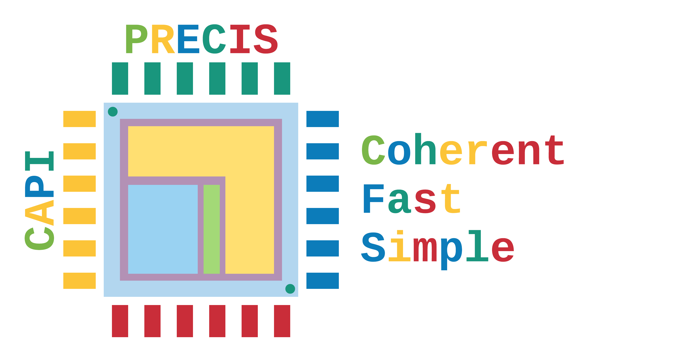
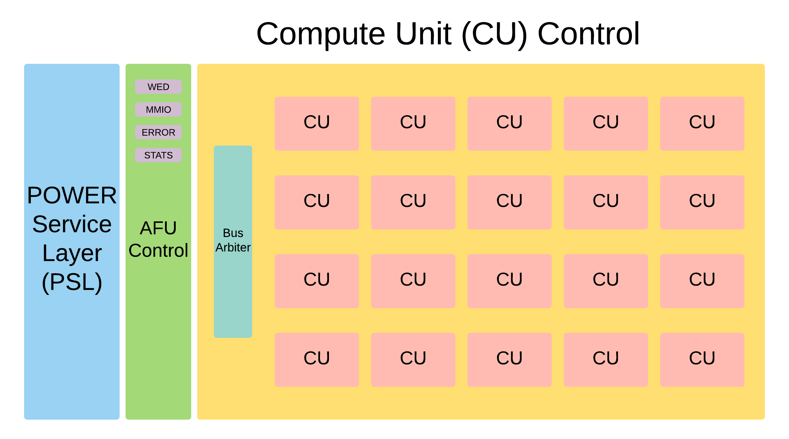
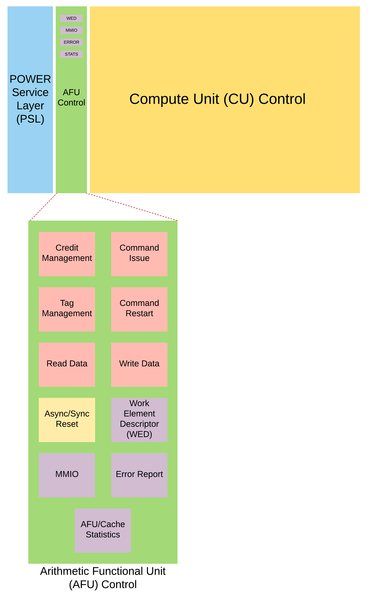
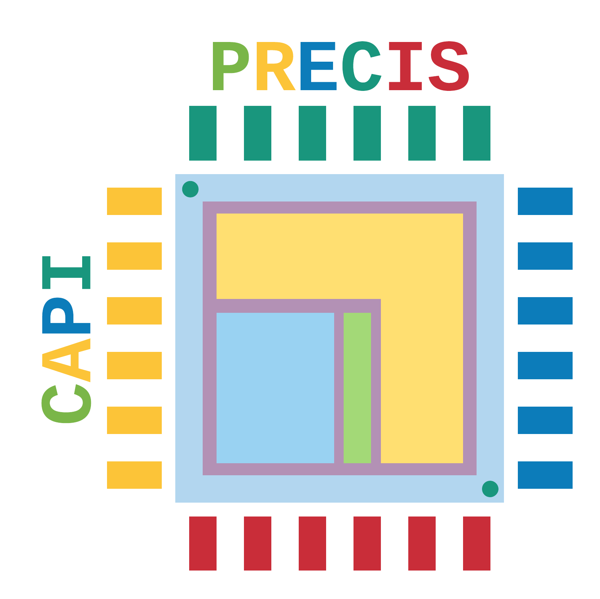

[](https://travis-ci.com/atmughrabi/CAPIPrecis)
<p align="center"></p>

#  Coherent Accelerator Processor Interface (CAPI) Abstract Layer

## Overview 

<p align="center"></p>

CAPI-Precis is an abstraction layer (AFU Control) that simplifies communication and buffering with the Power Service Layer (PSL). While each control unit handling different aspects of communication with the PSL, it simplifies the interface for sending and receving memory transactions, and preserves the fine-grain random or sequentail memory access pattern. Furthermore our layer differentiate its self from other CAPI frameworks, by keeping the PSL cache support.

# Installation 

## Dependencies

### OpenMP
1. OpenMP is already a feature of the compiler, so this step is not necessary.
```console
CAPI@Precis:~$ sudo apt-get install libomp-dev
```

### CAPI
1. Simulation with ModelSim
  * Environment Variable setup, `HOME` and `ALTERAPATH` depend on where you clone the repository and install ModelSim.
```bash
#CAPI framework env variables
export PSLSE_INSTALL_DIR="${HOME}/00_CAPIPrecis/01_capi_integration/pslse"
export VPI_USER_H_DIR="${ALTERAPATH}/modelsim_ase/include"
export PSLVER=8
export BIT32=n
export LD_LIBRARY_PATH="$LD_LIBRARY_PATH:$PSLSE_INSTALL_DIR/libcxl:$PSLSE_INSTALL_DIR/afu_driver/src"

#PSLSE env variables
export PSLSE_SERVER_DIR="${HOME}/00_CAPIPrecis/01_capi_integration/accelerator_sim/server"
export PSLSE_SERVER_DAT="${PSLSE_SERVER_DIR}/pslse_server.dat"
export SHIM_HOST_DAT="${PSLSE_SERVER_DIR}/shim_host.dat"
export PSLSE_PARMS="${PSLSE_SERVER_DIR}/pslse.parms"
export DEBUG_LOG_PATH="${PSLSE_SERVER_DIR}/debug.log"

```
2. AFU Communication with PSL
  * please check [(CAPI User's Manual)](http://www.nallatech.com/wp-content/uploads/IBM_CAPI_Users_Guide_1-2.pdf).

## Setting up the source code 

1. Clone CAPI-Precis.
```console
CAPI@Precis:~$ git clone https://github.com/atmughrabi/CAPIPrecis.git
```
2. From the home directory go to the CAPIPrecis directory:
```console
CAPI@Precis:~$ cd CAPIPrecis/
```
3. Setup the CAPI submodules.
```console
CAPI@Precis:~CAPIPrecis$ git submodule update --init --recursive
```

# Running CAPI-Precis

[](https://www.openmp.org/)

## Initial compilation for framework with OpenMP 

1. (Optional) From the root directory go to benchmark directory:
```console
CAPI@Precis:~CAPIPrecis$ cd 00_bench/
```
2. The default compilation is `openmp` mode:
```console
CAPI@Precis:~CAPIPrecis/00_bench$ make 
```
3. From the root directory you can modify the Makefile with the directories you need for you custom project:
```console
CAPI@Precis:~CAPIPrecis/00_bench$ make run
```
* OR
```console
CAPI@Precis:~CAPIPrecis/00_bench$ make run-openmp
```
[](https://openpowerfoundation.org/capi-drives-business-performance/)

## Initial compilation for framework with Coherent Accelerator Processor Interface (CAPI)  

* NOTE: You need CAPI environment setup on your machine.
* [CAPI Education Videos](https://developer.ibm.com/linuxonpower/capi/education/)
* We are not supporting CAPI-SNAP since our processing suite heavily depends on accelerator-cache. SNAP does not support this feature yet. So if you are interested in streaming applications or do not benefit from caches SNAP is a good candidate.
* For Deeper understanding of the SNAP framework: https://github.com/open-power/snap
* CAPI and SNAP on IBM developerworks: https://developer.ibm.com/linuxonpower/capi/  
* [IBM Developerworks Forum, tag CAPI_SNAP (to get support)](https://developer.ibm.com/answers/smartspace/capi-snap/index.html)

### Simulation

1. (Optional) From the root directory go to benchmark directory:
```console
CAPI@Precis:~CAPIPrecis$ cd 00_bench/
```
2. Run [Modelsim vsim] for `simulation` this step is not needed when running on real hardware, this just simulates the AFU that resides on your (CAPI supported) FPGA  :
```console
CAPI@Precis:~CAPIPrecis/00_bench$ make run-vsim
```
3. The previous step will execute vsim.tcl script to compile the design, to start the running the simulation just execute the following command at the transcript terminal of ModelSim : `r #recompile design`,`c #run simulation`
```console
ModelSim> r 
ModelSim> c 
```
4. Run [PSL Simulation Engine](https://github.com/ibm-capi/pslse) (PSLSE) for `simulation` this step is not needed when running on real hardware, this just emulates the PSL that resides on your (CAPI supported) IBM-PowerPC machine  :
```console
CAPI@Precis:~CAPIPrecis/00_bench$ make run-pslse
```
5. Runs algorithm that communicates with the PSLSE (simulation):
```console
CAPI@Precis:~CAPIPrecis/00_bench$ make run-capi-sim
```

### FPGA

#### Running

1. (Optional) From the root directory go to benchmark directory:
```console
CAPI@Precis:~CAPIPrecis$ cd 00_bench/
```
2. Runs algorithm that communicates with the or PSL (real HW):
```console
CAPI@Precis:~CAPIPrecis/00_bench$ make run-capi-fpga
```

#### Flashing image

1. From the root directory go to CAPI integration directory -> CAPIPrecis binary images:
```console
CAPI@Precis:~CAPIPrecis$ cd 01_capi_integration/accelerator_bin/
```
2. Flash the image to the corresponding `#define DEVICE` you can modify it according to your Power8 system from `00_bench/include/capienv.h`
```console
CAPI@Precis:~CAPIPrecis/01_capi_integration/accelerator_bin$ sudo capi-flash-script CAPIPrecis_ALGORITHM.rbf
```

# CAPI-Precis Structure:
<p align="center"></p>
<p align="center"></p>

### MMIO

### Command Issue

### Command Restart Issue

### Credit Managment

### Tag Managment

### Read Data

### Write Data

### Error Report

### Work Element Descriptor (WED)

### Prefetch Control

### Async/Sync Reset

### Response Control

# Organization 

* `00_bench`
  * `include` 
    * `algorithms` 
      * `openmp`  
        * `capi-precis.h`   
      * `capi` - CAPI integration
  * `src` 
    * `algorithms` 
      * `openmp`  
        * `capi-precis.c` 
      * `capi`
    * `utils`
* `01_capi_integration`
  * `accelerator` 
    * `cu`
    * `pkg`
    * `rtl`
  * `accelerator_bin`
  * `capi_common`
  * `pslse`
  * `libcxl`
  * `capi-utils`
* *`Makefile`* - Global makefile

Report bugs to <atmughra@ncsu.edu>
<p align="right"> </p>