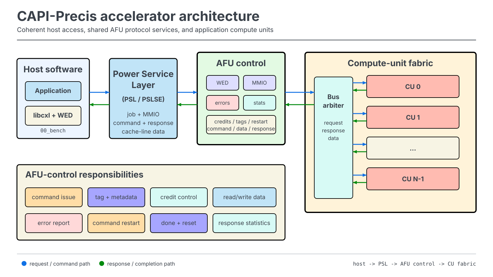

[](https://github.com/atmughrabi/CAPI-Precis/actions/workflows/verification.yml)

<p align="center">
  
</p>

# CAPI-Precis

CAPI-Precis is a reusable AFU-control layer for IBM's Coherent Accelerator
Processor Interface (CAPI). It separates application compute units from PSL
command, response, credit, tag, data, MMIO, error, completion, and reset
handling while retaining coherent cache access.

<p align="center">
  
</p>

## Scope

CAPI-Precis owns the shared host/AFU protocol used by downstream accelerators:

- bounded libcxl setup, MMIO, execution, completion, and reset handling;
- ordered PSL command/data buffers with fixed or round-robin arbitration;
- credit, tag, restart, response, parity, error, and statistics control;
- reusable memcpy, tutorial, and tiled-matrix compute-unit examples;
- exact RTL manifests, module ownership, portable elaboration, and coverage
  evidence.

[AccelGraph](https://github.com/atmughrabi/AccelGraph) consumes an exact
CAPI-Precis pin and owns graph-specific WEDs, engines, kernels, and scoreboards.
Those responsibilities are intentionally not duplicated here.

## Quick start

### Host and portable verification

```console
git clone https://github.com/atmughrabi/CAPI-Precis.git
cd CAPI-Precis
git submodule sync --recursive
git submodule update --init --recursive
sudo apt-get install build-essential tcl verilator
make verify
```

Verilator 5 or newer is required for RTL verification. ModelSim and Quartus are
needed only for the licensed simulation and implementation flows.

Run the OpenMP reference workload:

```console
make run-openmp
```

### Scoped CAPI environment

`tools/capi-env` configures one command or a temporary shell; it never requires
editing `.bashrc`.

```console
./tools/capi-env --mode host check
./tools/capi-env --mode sim --intel-fpga "$HOME/intelFPGA/18.1" check
./tools/capi-env --mode sim -- make run-vsim
./tools/capi-env --mode sim -- make run-pslse
./tools/capi-env --mode sim -- make run-capi-sim-verbose2
./tools/capi-env --mode fpga -- make run-capi-fpga-verbose2
```

Use `./tools/capi-env --mode sim shell` for a disposable configured shell. See
the [environment harness](https://github.com/atmughrabi/CAPI-Precis/wiki/Environment-Harness)
for custom install paths and the
[deployment runbook](https://github.com/atmughrabi/CAPI-Precis/wiki/Deployment-Runbook)
for simulator and FPGA sequencing.

## Verification

| Command | Evidence |
| --- | --- |
| `make verify` | Host, benchmark, environment, manifest, real-RTL, and module-family gates |
| `make rtl-manifest-verification` | Exact ModelSim/Quartus source order, inventory, and module ownership |
| `make rtl-real-elaboration` | Real `cached_afu` plus memcpy, tutorial, and mmtiled compute units |
| `make rtl-coverage-closure` | Complete executable ownership for all active RTL families |
| `make accelerator-verification` | Host timeout, MMIO, error, completion, and reset behavior |

The portable RTL denominator is 44 production modules, 13 active packages, 23
module families, and 114 build contexts. Licensed ModelSim/Quartus results and
hardware traces remain separate release evidence.

## Repository layout

| Path | Responsibility |
| --- | --- |
| `00_bench` | Host applications, OpenMP references, CAPI launch code, and tests |
| `01_capi_integration/accelerator_rtl` | Synthesizable AFU and compute-unit RTL |
| `01_capi_integration/accelerator_verification` | Host, RTL unit, integration, manifest, and simulation evidence |
| `01_capi_integration/accelerator_sim` | PSLSE and ModelSim flow |
| `01_capi_integration/accelerator_synth` | Quartus flow |
| `docs` | Maintained documentation and wiki source |
| `tools` | Scoped environment harness and tests |

The complete naming and ownership contract is maintained in
[Repository structure](https://github.com/atmughrabi/CAPI-Precis/wiki/Repository-Structure).
Historical presentations and chip-planner images remain under `02_slides`.

## Documentation

| Topic | Canonical page |
| --- | --- |
| Host/FPGA boundaries and block semantics | [Architecture](https://github.com/atmughrabi/CAPI-Precis/wiki/Architecture) |
| Timeout and RTL lifecycle contract | [Accelerator verification](https://github.com/atmughrabi/CAPI-Precis/wiki/Accelerator-Verification) |
| Simulation, synthesis, FPGA launch, and triage | [Deployment runbook](https://github.com/atmughrabi/CAPI-Precis/wiki/Deployment-Runbook) |
| Module tests, scoreboards, mutations, and coverage | [Verification infrastructure](https://github.com/atmughrabi/CAPI-Precis/wiki/Verification-Infrastructure) |
| Acceptance and rollout | [Stabilization plan](https://github.com/atmughrabi/CAPI-Precis/wiki/Stabilization-Plan) |

`docs/wiki` is the editable source of truth; the GitHub wiki is its published
mirror. Start at [`docs/README.md`](docs/README.md) when editing documentation.

## Platform

The original hardware target is the Nallatech P385-A7 with an Altera
Stratix-V-GX-A7 FPGA. The retained implementation flow uses Quartus II 18.1 and
ModelSim; portable host and Verilator checks run independently of those tools.
CAPI-SNAP is outside this cache-oriented design.

## Contact

Report defects to <atmughrabi@gmail.com> or <atmughra@ncsu.edu>.
