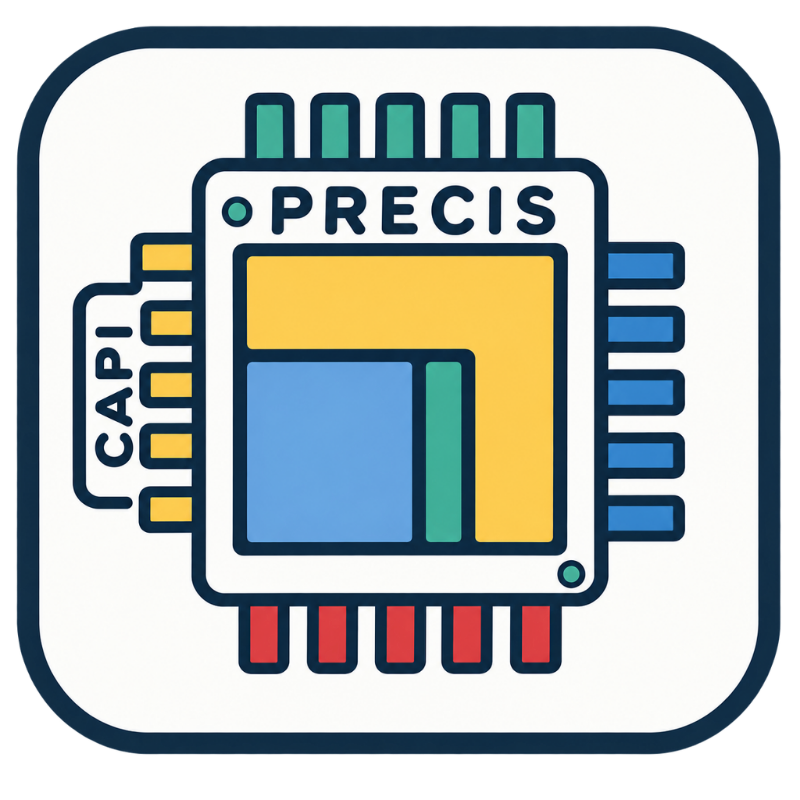

# CAPI-Precis documentation

  

`docs/wiki/*.md` is the editable documentation source of truth. The GitHub wiki
is a published mirror; wiki-side edits are overwritten by the publisher.

- [Accelerator verification](wiki/Accelerator-Verification.md)
- [Architecture](wiki/Architecture.md)
- [Environment harness](wiki/Environment-Harness.md)
- [Deployment runbook](wiki/Deployment-Runbook.md)
- [Repository structure](wiki/Repository-Structure.md)
- [Verification infrastructure roadmap](wiki/Verification-Infrastructure.md)
- [Stabilization plan](wiki/Stabilization-Plan.md)
- [Accelerator verification files](../01_capi_integration/accelerator_verification/README.md)

The enabled GitHub Wiki is published from `docs/wiki`. Edit this source and
mirror it to the wiki repository; do not maintain independent page content.

## Brand assets

- [SVG logo](../02_slides/logo/logo.svg) - preferred for documentation
- [PNG logo](../02_slides/logo/logo.png) - raster fallback

## Architecture assets

- [CAPI-Precis architecture SVG](fig/capi-precis-architecture.svg)
- [AFU-control detail SVG](fig/capi-precis-afu-control.svg)
- [Original architecture PNG](fig/capi-precis-architecture.png)
- [Original AFU-control PNG](fig/capi-precis-afu-control.png)
- [FPGA chip planner](fig/capi-precis-chip-planner.png)
